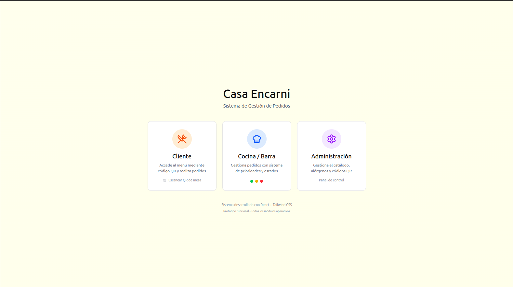
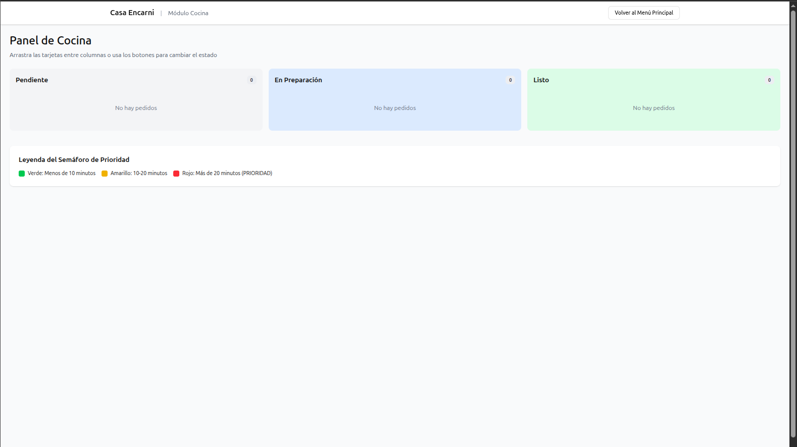
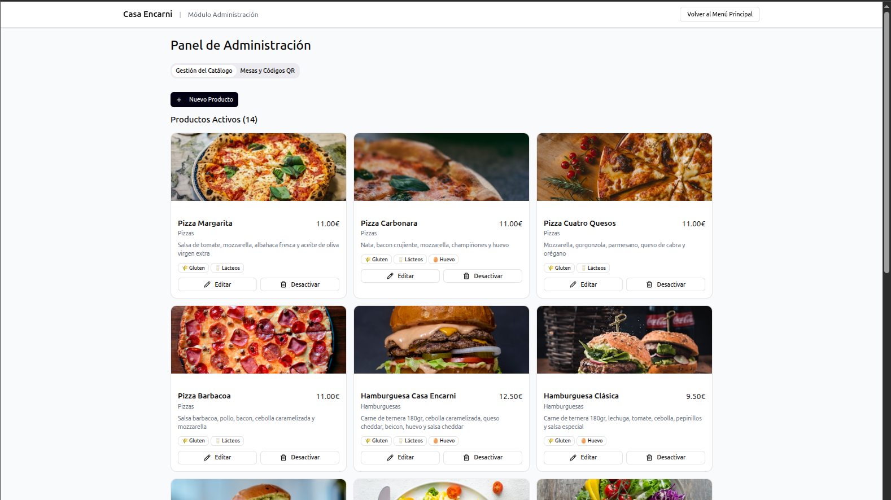

## 1 Requisitos funcionales

Se agrupan según los módulos principales del sistema. Cada RF incluye una breve descripción y criterios de aceptación básicos.

### 1.1 Módulo Cliente

Objetivo: ofrecer una experiencia rápida y accesible para que los clientes consulten la carta y pidan desde la mesa.

- **RF-01 — Acceso Directo QR**
  - Descripción: al escanear el QR la app identifica la mesa y muestra la carta sin login.
  - Criterios de aceptación: QR mapea a una mesa y abre la vista de menú con contexto de mesa.

- **RF-02 — Navegación (Scroll único)**
  - Descripción: todo el menú en una única vista vertical; anclajes por secciones con scroll suave.
  - Criterios: navega entre secciones sin recargar, comportamiento fluido en móvil.

- **RF-03 — Filtro de Alérgenos**
  - Descripción: columna lateral con filtros (ej. "Sin Gluten"). Al seleccionar, se ocultan productos con esos alérgenos.
  - Criterios: la selección actualiza inmediatamente la lista de productos; opción para ver detalles de alérgenos por producto.

- **RF-04 — Añadido rápido**
  - Descripción: botón [+] en cada tarjeta que añade 1 unidad al carrito sin abrir ficha.
  - Criterios: al tocar, el carrito aumenta la cantidad y muestra confirmación mínima.

- **RF-05 — Carrito flotante**
  - Descripción: resumen persistente en la parte inferior con acceso rápido a confirmar pedido.
  - Criterios: visible en todas las vistas del menú, accesible con un toque.

> Nota UX: diseñar para interacción táctil, botones grandes y feedback claro al añadir productos.

---

### 1.2 Módulo Cocina y Barra

Objetivo: panel operativo para gestionar pedidos con visibilidad de estado y prioridad.

- **RF-06 — Tablero de pedidos**
  - Descripción: tablero tipo Kanban con columnas: Pendiente, En Preparación, Listo. Actualización en tiempo real.
  - Criterios: nuevas órdenes aparecen automáticamente; movimiento entre columnas actualiza estado.

- **RF-07 — Interacciones rápidas**
  - Descripción: cambio de estado con un toque o arrastrando la tarjeta.
  - Criterios: táctil-friendly, mínimo número de toques para cambiar estado.

- **RF-08 — Semáforo de prioridad**
  - Descripción: tarjetas cambian color según tiempo de espera (verde/amarillo/rojo).
  - Criterios: color refleja regla de tiempos configurables; alertas visuales claras.

- **RF-09 — Notas críticas resaltadas**
  - Descripción: destacar notas como "ALERGIA" o "SIN SAL" con alto contraste/iconos.
  - Criterios: notas visibles desde vista principal del pedido.

- **RF-10 — Cierre de mesa y cálculo automático**
  - Descripción: botón "Pedir la Cuenta" que suma los productos de la sesión y genera el desglose.
  - Criterios: cálculo correcto del total, posibilidad de corregir errores antes de cerrar.

> Operativa: registrar timestamps para políticas de prioridad y semáforo; confirmar cambios para evitar errores.

---

### 1.3 Módulo Administración

Objetivo: herramientas administrativas para gestionar catálogo, mesas y códigos QR.

- **RF-11 — Gestión del catálogo**
  - Descripción: crear/editar platos, precios, fotos y asignar alérgenos obligatorios.
  - Criterios: formulario con validación y selector de alérgenos; subida de imágenes con previsualización.

- **RF-12 — Generación de QR**
  - Descripción: crear mesas y descargar códigos QR listos para impresión (PNG/SVG).
  - Criterios: exportar QR por mesa, opción para descargar zip de varios códigos.

---

## 2 Herramientas y Tecnologías

Tabla resumen con recomendaciones prácticas.

| Herramienta / Tecnología | Uso principal | Recomendación |
|---|---|---|
| Figma | Diseño y prototipado | Prototipos interactivos y exportación de assets optimizados.
| GitHub | Control de versiones y CI | Usar ramas feature, PRs y GitHub Actions para CI.
| Visual Studio Code | IDE recomendado | Instalar Prettier, ESLint y plugins de Symfony/Docker.
| Tailwind CSS | Estilado rápido y responsive | Usar sistema de componentes y variables de diseño.
| Symfony 8 | Backend | API-first, validación y seguridad en servidor.
| MySQL | Base de datos relacional | Versionado de esquema y backups regulares.
| Docker Compose | Entorno local | Contenerizar servicios (app, db, mercure).
| Mercure | Tiempo real cocina | Suscripciones para notificaciones en tablero de cocina.

---

## 3 Diseño de Interfaces (resumen técnico)

- Frontend: JavaScript (componentes) + Tailwind CSS.
- Backend: Symfony 8 (API REST / endpoints para comanda, gestión y auth).
- Infraestructura: Docker Compose para desarrollo y despliegue.
- Tiempo real: Mercure para eventos de pedidos.

Recomendaciones: Componentizar vistas (MenuItem, Cart, OrdersBoard) y documentar contratos API (OpenAPI).

---

## 4 Modelo de Datos

Entidades principales (resumen):

- MESAS: id, codigo_qr, estado
- CATEGORIAS: id, nombre, orden
- PRODUCTOS: id, nombre, descripcion, precio, activo, imagen
- ALERGENOS: id, nombre
- PRODUCTO_ALERGENO: producto_id, alergeno_id
- PEDIDOS: id, mesa_id, estado, timestamp_creacion, total
- DETALLE_PEDIDO: id, pedido_id, producto_id, cantidad, notas

Notas: mantener integridad referencial y campos de auditoría (created_at, updated_at).

---

## 5 Accesibilidad y Seguridad

- Garantizar contraste suficiente, tamaño de hit targets y etiquetas ARIA.
- Validación en backend de alérgenos y notas críticas.
- Roles: Admin, Camarero, Cocina (control de accesos y permisos).

---

## 6 Imágenes y Recursos Visuales

Las imágenes de diseño se almacenan en `docs/img/`.

**Mockups de Figma**

- Menú (Figma)
  

- Vista Cliente
  

- Vista Camarero / Cocina
  

- Panel Admin
  

---
